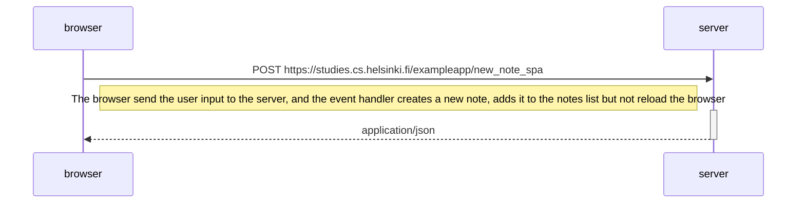

```mermaid
sequenceDiagram
    participant browser
    participant server

    browser->>server: POST https://studies.cs.helsinki.fi/exampleapp/new_note_spa

    Note right of browser: The browser send the user input to the server, and the event handler creates a new note, adds it to the notes list but not reload the browser
    activate server

    server-->>browser: application/json
    deactivate server
```